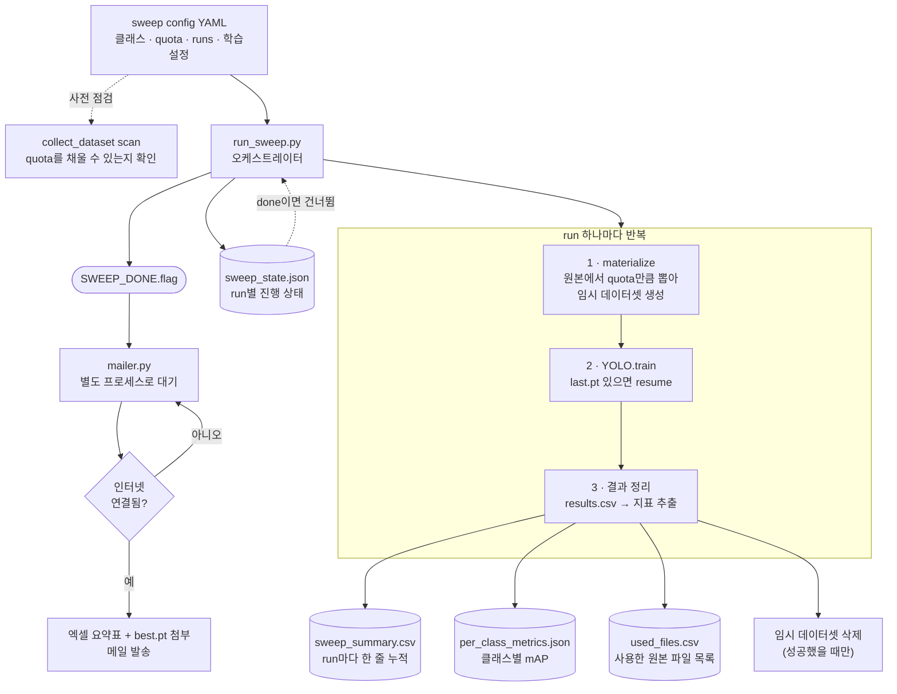

# 학습 자동화 시스템 구조

**정리일** 2026-08-04 · **대상** `scripts/sweep/` + `configs/sweeps/`
**검증** detect_v4(2026-07-30, 시스템 검증) → **detect_v5(2026-08-03, 본격 학습 완료)**

사람이 지켜보지 않아도 여러 학습을 순차로 돌리고, 결과를 정리해 메일로 보내는 시스템.
이 문서는 **무엇이 어떤 구조로 맞물려 있는지**를 정리한다.

---

## 1. 이 시스템이 풀어야 했던 제약

구조가 이렇게 생긴 이유는 전부 아래 환경에서 나왔다.

| 제약 | 설계에 미친 영향 |
|---|---|
| GPU는 본사 장비를 **빌려 씀** — 사용 시간이 제한적 | 사람 개입 없이 여러 run을 **순차 자동 실행** |
| 워크스테이션에 **인터넷이 없음** | 외부 API 호출 0. 결과 전송은 **연결되는 순간을 기다렸다가** |
| 학습이 며칠 단위 — 프로세스가 죽거나 **재부팅될 수 있음** | 상태를 파일에 남기고 **어느 지점에서든 재개** |
| 외장하드 **용량 부족** | 데이터셋은 임시로 만들고 학습 끝나면 **바로 삭제** |
| 데이터 실물을 지우는 운영 구조 | 어떤 파일을 썼는지 **목록을 결과와 함께 보관** |

---

## 2. 전체 흐름



---

## 3. 구성 요소

| 파일 | 역할 |
|---|---|
| `configs/sweeps/*.yaml` | **스윕 정의.** 클래스별 소스·장수, 학습 파라미터, 작업 폴더 |
| `run_sweep.py` | **오케스트레이터.** run 순차 실행, 상태 기록, 실패 처리, 디스크 정리 |
| `collect_dataset.py` | 설정을 읽어 **데이터셋을 실제로 만든다**(`scan` / `materialize`) |
| `label_formats.py` | 전역 class id ↔ 이번 실험의 로컬 id **리매핑** |
| `report.py` | `results.csv` 파싱 → 요약 CSV 누적, 엑셀 변환 |
| `mailer.py` | 학습 완료 대기 → 인터넷 감지 → 결과 메일 |
| `common.py` | 설정 로드, **원자적** 상태 저장, 로깅 |

### 설정 파일의 구조

```yaml
sweep_name: test3_18class_sweep01

dataset:
  external_root: /home/workstation/ai_cctv/AI_CCTV_DATASET/original
  split_seed: 42
  classes:
    BK:
      quota: {train: 12000, val: 1500, test: 1500}
      sources:                                    # 한 클래스가 여러 원본에서 옴
        - {type: seoul_txt, path: "rename_data_s20_s22_bbox/BK_S20_파손"}
        - {type: seoul_txt, path: "rename_data_s20_s22_bbox/S22_BK_05파손(BK)"}
        - {type: yolo_txt,  path: "aihub_data_bbox", code: BK}
    # … 나머지 클래스

workspace:
  dataset_root: …/_sweep_workspace/dataset       # 임시 (학습 후 삭제)
  results_root: …/_sweep_workspace/results       # 영구
  summary_csv:  …/_sweep_workspace/sweep_summary.csv

model: …/pretrained_models/yolo11l.pt
device: 0
cos_lr: true
patience: 30

runs:
  - {name: test3_960_e50, imgsz: 960, epochs: 50, batch: -1}
```

**설정 파일 하나가 데이터셋 구성과 학습 조건을 모두 담는다.** v4·v5의 데이터셋을 지금도 다시
만들 수 있는 이유가 이것이다(v1~v3는 설정이 남아 있지 않아 재현이 안 된다).

원본 소스는 폴더 구조가 제각각이라 3가지 타입을 지원한다:

| 타입 | 구조 | 쓰이는 곳 |
|---|---|---|
| `seoul_txt` | `<폴더>/images/`, `<폴더>/labels/` | 서울시 2020/2022 데이터 |
| `yolo_txt` | `<루트>/image/<코드>/`, `<루트>/labels/<코드>/` | AI Hub bbox |
| `dir_pair` | 이미지·라벨 폴더를 직접 지정 | 폴더명이 규칙적이지 않은 seg 데이터 |

---

## 4. 핵심 설계

### 결정적 샘플링 — 같은 설정이면 같은 데이터셋

```python
keyed = sorted(pool, key=lambda item: str(item[0]))   # 파일시스템 순서에 흔들리지 않게 먼저 정렬
rng = random.Random(f"{seed}:{class_code}")           # 클래스마다 독립된 시드
rng.shuffle(keyed)
```

정렬 후 셔플이라 **파일 나열 순서가 달라져도 결과가 같다.** 시드에 클래스 코드를 섞어서
한 클래스의 장수를 바꿔도 다른 클래스의 선택은 그대로다.

quota를 못 채우면 실패시키지 않고 **비율을 유지한 채 축소**하고 경고를 manifest에 남긴다.
데이터가 부족한 클래스(RT 440장 등)가 섞여 있어도 스윕 전체가 멈추지 않는다.

### 3단계 재개 — 어디서 죽어도 이어서

| 단위 | 판단 근거 | 동작 |
|---|---|---|
| **스윕** | `state.json`의 `status == "done"` | 완료된 run은 건너뜀 |
| **학습** | `weights/last.pt` 존재 | 그 지점부터 `resume=True` |
| **데이터셋** | `data.yaml` 존재 | 다시 만들지 않고 재사용 |

`last.pt`를 학습이 끝난 뒤에도 지우지 않는 이유가 이 재개 때문이다.

**실패했을 때는 임시 데이터셋을 지우지 않는다.** 성공했을 때만 지운다 — 재개하려면 데이터가
있어야 하기 때문이다.

```python
except Exception as e:
    state.set(run_name, status="failed", error=str(e))
    log.info(f"[{run_name}] 임시 데이터셋은 재개(resume)를 위해 보존함")
```

### 상태 파일은 원자적으로 쓴다

```python
fd, tmp_name = tempfile.mkstemp(dir=path.parent, prefix=".tmp_")
json.dump(data, ...)
Path(tmp_name).replace(path)      # 교체는 원자적
```

쓰는 도중 프로세스가 죽어도 기존 상태 파일이 깨지지 않는다.

### 클래스별 mAP를 따로 저장 — ultralytics를 그대로 믿지 않음

```python
evaluated = [int(c) for c in box.ap_class_index]   # 실제로 평가된 클래스만
per_class = {name: None for name in names.values()}
for i, c in enumerate(evaluated):
    per_class[names[c]] = {"map50": ..., "map50_95": ...}
```

> ultralytics의 `maps` 배열은 **평가되지 않은 클래스 자리에 전체 평균을 채워 넣는다.**
> 그대로 쓰면 val에 GT 박스가 없는 배경 클래스(`IN`·`PJ`)가 평균값을 가진 것처럼 보인다.
> `ap_class_index`로 실제 평가된 클래스만 기록하고 나머지는 `null`로 남긴다.

**v6에서 "정확도 높은 항목만 고르는" 근거가 되는 파일이 바로 이것이다.**

이 저장이 실패해도 run 자체는 성공으로 처리한다 — ultralytics 버전에 따라 속성이 다를 수 있어서.

### 디스크 회수와 추적 가능성

데이터셋 실물은 지우지만 **무엇을 썼는지는 남긴다.**

```
결과 폴더/
├── results.csv                    ← 학습 지표
├── per_class_metrics.json         ← 클래스별 mAP
├── materialize_manifest.json      ← 장수·박스 수·경고
├── used_files.csv                 ← 사용한 원본 파일 전체 목록
└── weights/{best,last}.pt
```

`used_files.csv`에는 `split, class, source_kind, source_path, dest_filename`이 행마다 들어간다.
데이터 파일을 지우는 운영 방식과 짝을 이루는 부분이다.

### 오프라인 우선 메일러

학습 중에는 **인터넷 확인조차 하지 않는다.** `SWEEP_DONE.flag`라는 로컬 파일만 가볍게 본다.

```
학습 진행 중        → flag 없음 → 60초마다 파일만 확인 (네트워크 접근 0)
모든 run 완료       → flag 생성 → 여기서부터 3시간마다 인터넷 확인
인터넷 연결됨       → 새 결과 있으면 발송, 없으면 대기
```

중복 발송은 `last_sent_count`(요약 CSV의 행 수)로 막는다. 새로 늘어난 행이 있을 때만 보낸다.

`best.pt`가 첨부 용량 제한(기본 20MB)을 넘으면 **그 파일만 빼고 표는 그대로 보낸다.**
가중치 하나 때문에 결과 전체가 안 오는 것을 막기 위해서다.

### 그 밖의 구조적 선택

- **라벨 인덱스 캐싱** — 이미지마다 `Path.exists()`를 부르면 폴더당 9만 장(AI Hub `IN`)일 때
  개별 stat 호출이 누적돼 매우 느려진다. 디렉터리를 **한 번만** 읽어 `stem → 경로` 맵으로 매칭
- **bbox·seg 공용** — 라벨 라인에서 맨 앞 class id만 바꾸고 **뒤 토큰은 그대로 보존**한다.
  4좌표 bbox든 폴리곤 seg든 같은 코드로 처리된다(v5에서 두 종류를 함께 돌린 근거)
- **ultralytics는 학습 시점에만 import** — `scan`이나 설계 단계에서 torch를 로딩하지 않는다
- **여러 설정 연속 실행** — `--config a.yaml b.yaml`로 주면 앞 스윕이 끝난 뒤 다음이 이어진다
  (v4·v5에서 bbox 학습 뒤 seg 학습이 자동으로 이어지도록 쓴 방식)

---

## 5. 사용 흐름

```bash
# 1. 라벨 매핑·장수 사전 점검 (복사 없이 확인만)
python collect_dataset.py scan --config ../../configs/sweeps/test3_18class.yaml

# 2. 스윕 실행 — bbox 끝나면 seg가 이어서
nohup python run_sweep.py \
  --config ../../configs/sweeps/test3_18class.yaml \
           ../../configs/sweeps/test4_seg.yaml &

# 3. 메일러는 따로 띄워두면 됨 (오프라인이어도 계속 대기)
nohup python mailer.py --config ../../configs/sweeps/test3_18class.yaml \
                       --mail-config mail_config.yaml &
```

`scan`을 먼저 돌리는 것이 중요하다. 클래스별로 **quota를 채울 수 있는지** 미리 보여주므로,
몇 시간 학습을 돌린 뒤에야 데이터가 모자란 것을 알게 되는 상황을 막는다.

---

## 6. 검증 결과와 알려진 한계

### 검증

| 시점 | 내용 | 결과 |
|---|---|---|
| 2026-07-30 (v4) | 20시간 규모로 줄여 **시스템 동작 확인** | 동작 확인. 소요 시간 예측(13.1h 산정 vs 14.0분/에폭 실측)도 부합 |
| 2026-08-03 (v5) | bbox 167,489장 + seg 27,579장 **본격 학습** | **오류 없이 완료** |

### 한계

**프로세스가 죽으면 상태가 `running`으로 남는다.** v4가 24에폭에서 멈췄을 때 상태 파일은
아직도 이렇게 남아 있다:

```json
{ "runs": { "test3_18class_20h_260729_960_e50": {
    "status": "running", "started_at": "2026-07-30T09:59:58+09:00", "error": null } } }
```

예외를 잡으면 `failed`로 기록하지만, **프로세스 자체가 죽으면 기록할 기회가 없다.**
파일만 보면 아직 돌고 있는 것처럼 보인다. 하트비트(주기적 타임스탬프 갱신)를 넣으면
"마지막 갱신이 N시간 전"으로 판별할 수 있다.

**실패한 run이 있어도 다음 run으로 계속 진행한다.** 이건 의도된 동작이다 — 한 조합이
실패했다고 나머지 스윕을 버릴 이유가 없다. 다만 원인이 공통(디스크 부족 등)이면 뒤따르는
run도 줄줄이 실패한다.

---

## 7. 다음에 이 시스템으로 할 일

**v6(2026-08-10 예정)** — v5의 `per_class_metrics.json`에서 정확도가 높은 항목만 추려
설정 파일의 `classes` 블록을 새로 구성하면 된다. seg가 유의미한 항목은 `test4_seg.yaml`
쪽 소스를 섞어 쓴다.

시스템 자체는 손댈 필요 없이 **설정 파일만 바꾸면 되는 구조**다.

---

관련 문서 — [`scripts/sweep/README.md`](../../scripts/sweep/README.md) (실행 절차) ·
[`docs/reports/2026-08-04-모델학습-실험정리.md`](2026-08-04-모델학습-실험정리.md) (실험 경과)
