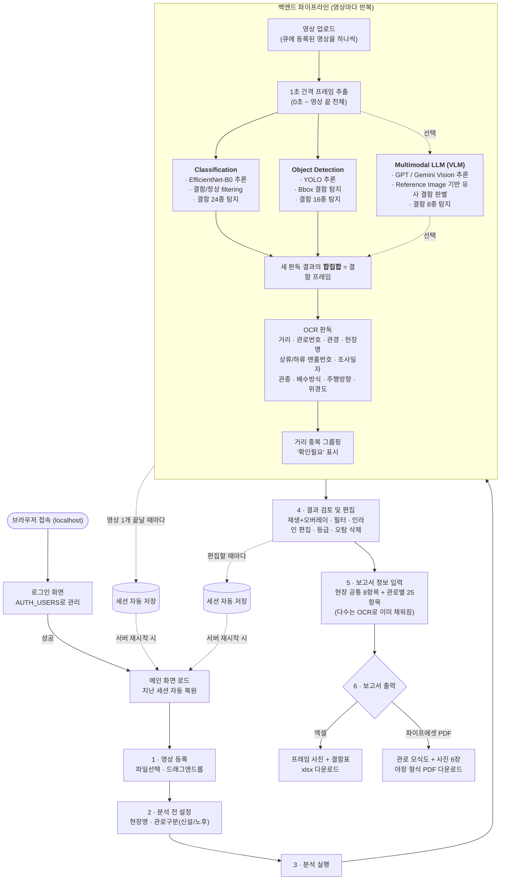

# 전체 유저플로우 — AI CCTV 결함 분석기

**작성일** 2026-08-05 · **대상** `apps/AI_CCTV` 전체 (진입 → 분석 → 검토 → 출력)

사용자가 앱을 켜서 보고서를 손에 넣기까지 전체 경로를 정리한다. 코드 변경 보고서가 아니라
**현재 코드가 실제로 어떻게 동작하는지**를 그대로 옮긴 것이라, 기능이 바뀌면 이 문서도 함께
갱신해야 한다.

---

## 1. 전체 여정 (한 장 요약)



---

## 2. 진입

| 진입점 | 추론 위치 | 인증 | 비고 |
|---|---|---|---|
| **`serve_web_cpu.py`** | **이 PC의 CPU** | `AUTH_USERS` 환경변수(`아이디:비번,...`) | **지금 쓰는 경로.** `assets/best.pt` 필요. yolo11l·imgsz 960 기준 프레임당 약 0.44초(22코어). Colab 연결 패널(`#colabCard`)은 CSS로 감춘다 |
| `serve_web.py` | Colab 원격 | 위와 동일 | 옛 경로. `AuthGateMiddleware`가 `/login`·`/api/auth/login` 외 모든 요청을 로그인으로 리다이렉트 |
| `main.py` | Colab 원격 | 없음 | 데스크톱 exe (pywebview 창) |

다수 사용자를 대상으로 만드는 앱이라 웹 경로 하나로 통일했다. 지금은 시연 단계라 서버를
localhost로만 띄워두고 있고, 외부 접속용 배포(도메인·터널 등)는 아직 하지 않았다.

**추론을 어디서 돌리는가 — 지금과 앞으로.** 기본은 `serve_web_cpu.py`, 즉 이 PC의
CPU다(분류기도 YOLO도 로컬). 회사 서버가 서면 그쪽 **GPU**로 넘기고, 서버를 못 쓰고
인터넷만 되는 환경에서는 **LLM 판독**을 보조로 켠다. 아래 4장 참고.

**서버가 뜨는 순간** `session_store.load()`가 먼저 실행돼, 이전에 저장된 분석 결과·보고서
정보·현장명 등을 전부 복원한다. 실패해도 서버는 빈 상태로 뜬다.

---

## 3. 영상 등록

| 방법 | 엔드포인트 |
|---|---|
| [파일추가] 클릭 또는 큐 카드 위 드래그앤드롭 | `/api/queue/upload` (진행률 표시) |

업로드는 확장자를 제한하지 않는다 — 실제로 OpenCV가 열리는지로만 판단한다(현장 영상은
확장자가 제각각이라서). 업로드 후 `refreshQueue()`가 큐 목록을 갱신하고, 첫 영상을 자동
선택해 미리보기에 띄운다. 영상 하나가 열리지 않아도(코덱 문제 등) 로그만 남기고 나머지
초기화는 계속된다.

---

## 4. 분석 전 설정

우측 상단 입력줄에서 두 가지를 정한다.

- **현장명** — 자유 텍스트. **관로별로 저장된다**(관로마다 현장이 다를 수 있어서).
  아무 영상도 선택하지 않은 상태에서 입력하면 현장 전체 기본값이 된다
- **관로구분(신설/노후)** — 체크박스 2개, 배타 선택. **미선택 시 [분석 실행] 자체가 막힌다**
  (프론트엔드 확인 + 백엔드 `start_analysis()` 이중 검증)

관로구분은 값이 바뀔 때마다 즉시 세션에 저장된다.

### 추론을 어디서 돌릴지

`serve_web_cpu.py`에는 서버 연결 패널이 없다(`#colabCard`를 감춘다). 선택은 하나뿐이다.

| 상황 | 추론(YOLO·필터) | LLM 판독 |
|---|---|---|
| 기본 (지금) | **이 PC의 CPU** — 프레임당 약 0.44초 | 꺼짐 |
| 회사 서버(GPU) 연결됨 | **서버 GPU** — 1초 간격 프레임을 서버로 보내 거기서 추론 *(예정)* | 꺼짐 |
| 서버 불가 · 인터넷만 됨 | 이 PC의 CPU | **켬** — 사용자가 API 키를 직접 넣는다 |

**LLM 판독**은 화면의 [LLM 판독] 줄 → [사용]에서 켠다. OpenAI/Google 키를 그 자리에서
입력하고, 키는 **메모리에만 두고 디스크에 저장하지 않는다**(세션 파일에 넣으면 결과를
주고받을 때 키가 딸려 나간다). 호출이 이 PC에서 직접 나가므로 외부가 막힌 사내망에서는
켜지지 않는다. 이름만 후보로 덧붙일 뿐 박스는 만들지 않는다.

> **서버 GPU 경로는 아직 구현 전이다.** 지금 남아 있는 원격 코드(`call_yolo_remote`,
> `remote_yolo_url`)는 Colab+ngrok용이라 **YOLO만** 원격으로 보내고 분류기는 항상
> 로컬이며, 프레임을 전부 추출해 디스크에 쓴 뒤 24장씩 청크로 올린다. 회사 서버로
> 옮길 때 (1) 분류기도 원격으로, (2) 추출 즉시 전송 — 두 가지를 손봐야 한다.

---

## 5. 분석 실행 — 백엔드 파이프라인

[분석 실행] 클릭 → `POST /api/analysis/run` → 백그라운드 스레드에서 큐에 있는 **영상마다
순서대로** 아래 단계를 반복한다. 진행 상황은 WebSocket으로 실시간 로그 전송.

> **2026-08-15 갱신** — 8/12에 구조가 뒤집혔다(`FILTER_MODE=lead`). 예전에는 YOLO가
> 박스를 친 프레임만 표의 행이 됐는데, 지금은 **분류기가 고른 구간이 행이 되고 YOLO는
> 이름·박스를 얹는다.** 8/15에 분류기가 필터와 1차 이름을 겸하도록 확정됐다.
> 상세는 [필터C+test3 병렬 확정](2026-08-15-필터C-test3-병렬-확정.md).

```
1. 프레임 추출       extract_frames() — 0초부터 영상 끝까지 전체를 1초 간격
                    (FRAME_INTERVAL)으로 JPEG 저장
                    (2초는 한 프레임에 0.6m씩 건너뛰어 결함이 사이로 빠져 폐기)

2. 분류기 실행       defect_classifier.analyze() — 로컬 ONNX 1회로 두 값을 함께 얻는다
                    · 결함확률 = 24클래스 중 "정상 계열이 아닐 확률"
                    · 1차 이름 = 최댓값 클래스 (확신 0.9 이상일 때만)
                    서버 연결 여부와 무관하게 **항상 로컬**에서 돈다

3. 구간 선별(lead)   _filter_runs() — 영상 안에서의 **순위 상위 20%**를 자른다
                    (절대 임계값이 아니다 — 야장은 결함 45%인데 실영상은 1.5%라
                     같은 임계값이 전혀 다르게 동작한다)
                    이어진 프레임끼리 한 구간으로 묶어 구간마다 행 1개

4. YOLO 추론(병렬)   remote_yolo_url이 있으면 → call_yolo_remote() (24장씩 청크 전송)
                    없으면               → call_yolo() (로컬 CPU)
                    **분류기 점수가 0.1 미만인 프레임의 검출은 버린다**
                    (YOLO는 관 밖을 82~89% 결함이라 부른다 — 분류기는 0%)

4b. LLM 3차 의견     (선택, 기본 꺼짐) Gemini+GPT로 이름만 추가. 박스는 만들지 않는다

5. 이름 합치기       YOLO 이름을 앞에, 분류기·LLM이 추가로 본 것을 뒤에 후보로 나열
                    아무도 못 붙이면 "확인필요(이름 미부여)" — 검수자가 고른다

6. 자막 오탐 제거     탐지 박스가 자막 영역(위도/경도 등)의 70% 이상을 덮으면 결함에서 제외
                    (yolo_infer.py / yolo_remote.py 안에서 처리)

7. 메타데이터 OCR    ocr_overlay_metadata() — 영상당 프레임 1장에서 8종 한 번에 읽음:
                    관로번호·관경·현장명·상류/하류맨홀번호·조사일자·관종·배수방식·
                    주행방향·위경도
                    → 이미 채워진 항목은 덮어쓰지 않음(검수 결과 보존)

8. 거리 재판독       결함이 잡힌 프레임마다 ocr_distance_from_frame()으로 개별 재확인
                    (메타데이터 OCR의 거리값보다 이쪽을 우선 사용)

9. 결함 그리기       annotate_frame() — bbox+라벨+신뢰도를 그린 프레임(보고서용)과
                    UI 오버레이용 정규화 좌표(0~1)를 함께 생성
                    **박스는 YOLO 검출이 있는 행에만 있다** (분류기는 위치를 모른다)

10. 그룹핑          mark_dist_conflicts() — 같은 거리에 결함이 2건 이상이면
                    "확인필요" 비고 자동 부여 → 결과표에서 그룹으로 묶여 보임

11. 거리 자동 채움   _update_travel_distance() — 이 영상의 결함 중 가장 먼 거리를
                    총주행거리·연장에 채우고 미주행거리는 0.0m으로
```

**구간 인식(조사 시작지점 탐색)은 2026-08-15에 제거했다.** 앞 30초를 OCR로 훑어
"조사시작" 자막을 찾던 단계(`try_ocr_find_range`/`OCR_FIND_START`)인데, 관 밖 구간을
잘라내는 일은 지금 두 가지가 대신한다 — **거리 판독**(자막 거리가 `OUTSIDE_DIST_M`
미만이면 아직 관 밖)과 **분류기의 관 외부 인식**(관 밖 오탐 0%, 그 프레임의 YOLO
검출을 버린다). 자막 문구에 기대지 않아도 되고 영상당 OCR 15번이 사라진다.

**영상 하나가 끝날 때마다 세션을 저장한다** — 여러 영상을 한 번에 돌리다 중간에 서버가
죽어도 그 지점까지는 남는다. 전체가 끝나면 프론트엔드에 `batch_done` 이벤트가 가서
"분석 완료! 감지 프레임: N개" 알림을 띄운다.

---

## 6. 결과 검토 및 편집

결과표(우측 패널)에는 **지금 선택한 관로의 결과만** 나온다. 여러 관로를 한 번에 분석하면
결과가 한 줄로 쭉 이어져 어느 관로 것인지 헷갈리기 때문이다. 통계 탭만 항상 전체를 본다.

| 조작 | 동작 |
|---|---|
| 행 클릭 / 키보드 ↑↓ | 해당 시점 프레임으로 이동, bbox 오버레이 표시 |
| 재생 중 | 현재 시점의 결함이 실시간으로 화면에 오버레이 |
| 신뢰도 슬라이더 / 클래스 칩 | 결과표·오버레이 동시 필터링 (표시만 바뀜, 삭제 아님) |
| 셀 더블클릭 | 직경·거리·비고 인라인 편집 |
| 결함항목 셀 | **코드 목록 드롭다운**에서 선택(`CC(균열-원주)` 형태로 표시, 저장은 코드만). 목록에 없는 값은 직접 입력 |
| 등급 드롭다운 | 소/중/대 — 야장 PDF 캡션에 반영 |
| 그룹(▶) 더블클릭/Enter/클릭 | 거리 중복 그룹 펼침·접힘 |
| [+ 행 추가] | 현재 재생 위치에 수동 행 삽입. 그 초가 차 있으면 **가장 가까운 빈 초**로 옮겨 넣고 어디에 들어갔는지 알려준다 |
| [- 행 삭제] | 선택 행(Ctrl+클릭 다중, Shift+클릭 범위) 또는 Del 키로 삭제 — 오탐 제거용 |
| [초기화] | 영상·결함·현장정보를 모두 비운다 (되돌릴 수 없음) |
| 통계 탭 | 영상별 × 결함종류별 집계 (항상 전체) |

**커서와 선택은 다른 개념이다.** 커서는 키보드(↑↓·Enter)가 가리키는 위치이고, 선택은 삭제
대상이다. 그룹을 펼치는 것은 '보기'일 뿐이라 선택을 건드리지 않는다 — 예전에는 이 둘을
하나로 처리해서 그룹을 펼치기만 해도 [- 행 삭제]가 그 거리의 행을 통째로 날렸다.

수동으로 추가한 행은 거리가 같아도 그룹으로 묶지 않고, "확인필요"도 붙이지 않는다.
검수하려고 일부러 찍은 지점이라 남의 그룹 안에 접혀 들어가면 찾을 수 없기 때문이다.

**행 편집·삭제·추가는 매번 세션에 저장된다.** 결함 코드를 고치면 한글명(`BK(파손)` 등)이
자동으로 따라간다.

---

## 7. 보고서 정보 입력

[보고서 정보] 버튼 → 관로(영상)를 고르는 드롭다운 + 입력 폼.

- **현장 공통 8항목** — 발주처·사업기간·처리구역·배수구역·배수분구·시공자·조사목적·조사자.
  라벨이 파란색으로 구분되며 어느 관로를 골라도 같은 값
- **관로별 25항목** — 맨홀번호·관종·배수방식(드롭다운+기타입력)·주행방향(드롭다운+기타입력)·
  거리·위경도·상태등급 등. 관로마다 따로 저장되며, 상당수는 5단계 OCR에서 **이미 채워져 있다**
- 사업명·관로번호는 이 창에서 읽기전용으로만 보임(수정은 4장의 현장명 칸, 결과표 관로번호 칸에서)

---

## 8. 보고서 출력

[보고서 출력] → **범위** 선택 + **형식** 선택 다이얼로그.

| 범위 | 내용 |
|---|---|
| 선택한 영상만 | 지금 보고 있는 관로 하나. 그 관로의 현장명·관로번호를 쓴다 |
| 분석한 전체 | 이번에 분석한 관로를 한 파일로. 파일명에 `전체N건`이 붙어 섞이지 않는다 |

| 형식 | 내용 | 저장 방식 |
|---|---|---|
| 엑셀 조사표(.xlsx) | 프레임 사진 + 결함 표, 한 시트 | 브라우저 다운로드 |
| 파이프에셋 야장(.pdf) | A4 세로, 상단 메타표 + 관로 모식도 + 사진 6장(2열×3행) | 브라우저 다운로드 |

파일명은 `CCTV조사표_현장명_관로번호_날짜.xlsx` 형태로 자동 생성된다. 서버 경로에 저장하면
접속한 사람이 아니라 서버 PC에 파일이 생기므로, 항상 브라우저 다운로드로 받는다.

---

## 9. 영속성 — 언제 저장되는가

`session_store.save()`가 호출되는 지점을 전부 모으면:

- 영상 큐 추가/삭제/업로드
- 분석 중 **영상 하나 완료마다** + 배치 전체 종료 시
- 결과 행 편집·삭제·수동 추가
- 현장명 · 관로구분 변경 (LLM 키는 저장하지 않는다 — 메모리에만 둔다)
- 보고서 정보(공통/관로별) 저장

서버가 재시작되면 `session_store.load()`가 이 전부를 되살린다. 프레임 이미지·업로드
영상도 `%LOCALAPPDATA%\AI_CCTV\`(고정 경로)에 있어 함께 살아남는다 — 임시 폴더를 쓰던
과거와 달리, 서버를 껐다 켜도 분석 결과가 사라지지 않는다.

---

## 10. 한 장 요약표

| 단계 | 사용자 액션 | 시스템 반응 |
|---|---|---|
| 진입 | 브라우저 접속(localhost) / 로그인 | 이전 세션 자동 복원 |
| 영상 등록 | 파일 선택 · 드래그앤드롭 | 큐에 추가, 첫 영상 자동 선택 |
| 사전 설정 | 현장명·관로구분 입력 (필요시 LLM 켜기) | 관로구분 미선택 시 분석 버튼 차단 |
| 분석 실행 | 버튼 클릭 | 영상별 12단계 파이프라인(분류기→YOLO 병렬), 실시간 로그, 영상마다 자동 저장 |
| 검토·편집 | 재생·필터·인라인 편집·등급·삭제 | 선택한 관로만 표시, 매 조작마다 자동 저장 |
| 보고서 정보 | 관로 선택 후 값 입력 | 공통/관로별 분리 저장, OCR로 이미 일부 채워짐 |
| 출력 | 범위(관로/전체) + 형식 선택 | 엑셀 또는 야장 PDF 다운로드 |

---

관련 문서 — [`docs/PRD.md`](../PRD.md) ·
[`docs/reports/2026-08-03-파이프에셋-야장-PDF.md`](2026-08-03-파이프에셋-야장-PDF.md) ·
[`docs/reports/2026-08-04-학습자동화-시스템구조.md`](2026-08-04-학습자동화-시스템구조.md)(학습 파이프라인은 별도 문서)
