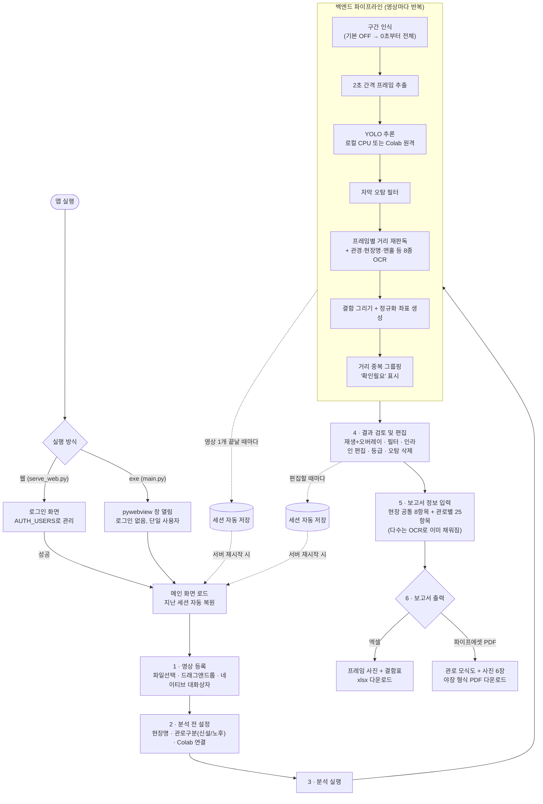

# 전체 유저플로우 — AI CCTV 결함 분석기

**작성일** 2026-08-05 · **대상** `apps/AI_CCTV` 전체 (진입 → 분석 → 검토 → 출력)

사용자가 앱을 켜서 보고서를 손에 넣기까지 전체 경로를 정리한다. 코드 변경 보고서가 아니라
**현재 코드가 실제로 어떻게 동작하는지**를 그대로 옮긴 것이라, 기능이 바뀌면 이 문서도 함께
갱신해야 한다.

---

## 1. 전체 여정 (한 장 요약)



---

## 2. 진입

| 실행 방식 | 진입점 | 인증 | 비고 |
|---|---|---|---|
| 데스크톱 exe | `main.py` | 없음 (단일 사용자) | 네이티브 파일 대화상자 사용 |
| 웹 브라우저 | `serve_web.py` | `AUTH_USERS` 환경변수(`아이디:비번,...`) | `AuthGateMiddleware`가 `/login`·`/api/auth/login` 외 모든 요청을 로그인으로 리다이렉트 |

두 경로는 같은 백엔드·프론트엔드를 공유한다. `window.__hasPywebview` 여부로 프론트엔드가
분기한다 — exe면 네이티브 대화상자, 웹이면 브라우저 파일 선택/드래그앤드롭·다운로드로
동작이 갈린다(3장, 6장 참고).

**서버가 뜨는 순간** `session_store.load()`가 먼저 실행돼, 이전에 저장된 분석 결과·보고서
정보·현장명 등을 전부 복원한다. 실패해도 서버는 빈 상태로 뜬다.

---

## 3. 영상 등록

| 환경 | 방법 | 엔드포인트 |
|---|---|---|
| exe | `open_video_dialog()` — 네이티브 창, 로컬 경로 그대로 큐에 추가 (복사 없음) | `/api/queue/add` |
| 웹 | [파일추가] 클릭 또는 큐 카드 위 드래그앤드롭 | `/api/queue/upload` (진행률 표시) |

웹 업로드는 확장자를 제한하지 않는다 — 실제로 OpenCV가 열리는지로만 판단한다(현장 영상은
확장자가 제각각이라서). 업로드 후 `refreshQueue()`가 큐 목록을 갱신하고, 첫 영상을 자동
선택해 미리보기에 띄운다. 영상 하나가 열리지 않아도(코덱 문제 등) 로그만 남기고 나머지
초기화는 계속된다.

---

## 4. 분석 전 설정

우측 상단 입력줄에서 세 가지를 정한다.

- **현장명** — 자유 텍스트, 전체 공통
- **관로구분(신설/노후)** — 체크박스 2개, 배타 선택. **미선택 시 [분석 실행] 자체가 막힌다**
  (프론트엔드 확인 + 백엔드 `start_analysis()` 이중 검증)
- **추론 서버(Colab)** — 비워두면 로컬 CPU 추론. ngrok 주소를 넣고 [연결]을 누르면
  `/predict` 엔드포인트가 실제로 응답하는지 확인 후 "연결됨"/"연결 실패"로 표시

이 중 관로구분·Colab 주소는 값이 바뀔 때마다 즉시 세션에 저장된다.

---

## 5. 분석 실행 — 백엔드 파이프라인

[분석 실행] 클릭 → `POST /api/analysis/run` → 백그라운드 스레드에서 큐에 있는 **영상마다
순서대로** 아래 단계를 반복한다. 진행 상황은 WebSocket으로 실시간 로그 전송.

```
1. 구간 인식        try_ocr_find_range() — 기본 OFF(OCR_FIND_START=0),
                    켜져 있으면 앞 30초를 훑어 "조사시작" 자막을 찾음
                    → 못 찾으면(기본 상태) 0초 ~ 영상 끝 전체를 대상으로

2. 프레임 추출       extract_frames() — 2초 간격(FRAME_INTERVAL)으로 JPEG 저장
                    (영상을 통째로 GPU에 넣지 않고 정지 이미지로 쪼갠다)

3. YOLO 추론         remote_yolo_url이 있으면 → call_yolo_remote() (24장씩 청크 전송)
                    없으면               → call_yolo() (로컬 CPU)

4. 자막 오탐 제거     탐지 박스가 자막 영역(위도/경도 등)의 70% 이상을 덮으면 결함에서 제외
                    (yolo_infer.py / yolo_remote.py 안에서 처리)

5. 메타데이터 OCR    ocr_overlay_metadata() — 영상당 프레임 1장에서 8종 한 번에 읽음:
                    관로번호·관경·현장명·상류/하류맨홀번호·조사일자·관종·배수방식·
                    주행방향·위경도
                    → 이미 채워진 항목은 덮어쓰지 않음(검수 결과 보존)

6. 거리 재판독       결함이 잡힌 프레임마다 ocr_distance_from_frame()으로 개별 재확인
                    (메타데이터 OCR의 거리값보다 이쪽을 우선 사용)

7. 결함 그리기       annotate_frame() — bbox+라벨+신뢰도를 그린 프레임(보고서용)과
                    UI 오버레이용 정규화 좌표(0~1)를 함께 생성

8. 그룹핑           mark_dist_conflicts() — 같은 거리에 결함이 2건 이상이면
                    "확인필요" 비고 자동 부여 → 결과표에서 그룹으로 묶여 보임

9. 거리 자동 채움    _update_travel_distance() — 이 영상의 결함 중 가장 먼 거리를
                    총주행거리·연장에 채우고 미주행거리는 0.0m으로
```

**영상 하나가 끝날 때마다 세션을 저장한다** — 여러 영상을 한 번에 돌리다 중간에 서버가
죽어도 그 지점까지는 남는다. 전체가 끝나면 프론트엔드에 `batch_done` 이벤트가 가서
"분석 완료! 감지 프레임: N개" 알림을 띄운다.

---

## 6. 결과 검토 및 편집

결과표(우측 패널)에서 하는 작업들.

| 조작 | 동작 |
|---|---|
| 행 클릭 / 키보드 ↑↓ | 해당 시점 프레임으로 이동, bbox 오버레이 표시 |
| 재생 중 | 현재 시점의 결함이 실시간으로 화면에 오버레이 |
| 신뢰도 슬라이더 / 클래스 칩 | 결과표·오버레이 동시 필터링 (표시만 바뀜, 삭제 아님) |
| 셀 더블클릭 | 직경·거리·결함코드·비고 인라인 편집 |
| 등급 드롭다운 | 소/중/대 — 야장 PDF 캡션에 반영 |
| 그룹(▶) 더블클릭/Enter/클릭 | 거리 중복 그룹 펼침·접힘 |
| [+ 행 추가] | 현재 재생 위치에 수동 행 삽입 (같은 시각 중복은 차단) |
| [- 행 삭제] | 선택 행(Ctrl+클릭 다중 선택) 또는 Del 키로 삭제 — 오탐 제거용 |
| 통계 탭 | 영상별 × 결함종류별 집계 |

**행 편집·삭제·추가는 매번 세션에 저장된다.** 결함 코드를 고치면 한글명(`BK(파손)` 등)이
자동으로 따라간다.

---

## 7. 보고서 정보 입력

[보고서 정보] 버튼 → 관로(영상)를 고르는 드롭다운 + 입력 폼.

- **현장 공통 8항목** — 발주처·사업기간·처리구역·배수구역·배수분구·시공자·조사목적·조사자.
  라벨이 파란색으로 구분되며 어느 관로를 골라도 같은 값
- **관로별 25항목** — 맨홀번호·관종·배수방식(드롭다운+기타입력)·주행방향(드롭다운+기타입력)·
  거리·위경도·상태등급 등. 관로마다 따로 저장되며, 상당수는 5단계 OCR에서 **이미 채워져 있다**
- 사업명·관로번호는 이 창에서 읽기전용으로만 보임(수정은 4장의 현장명 칸, 결과표 관로번호 칸에서)

---

## 8. 보고서 출력

[보고서 출력] → 형식 선택 다이얼로그.

| 형식 | 내용 | 저장 방식 |
|---|---|---|
| 엑셀 조사표(.xlsx) | 프레임 사진 + 결함 표, 한 시트 | exe: 네이티브 저장 대화상자 / 웹: 브라우저 다운로드 |
| 파이프에셋 야장(.pdf) | A4 세로, 상단 메타표 + 관로 모식도 + 사진 6장(2열×3행) | 웹 다운로드만 (exe도 동일 경로 사용 가능) |

파일명은 `CCTV조사표_현장명_관로번호_날짜.xlsx` 형태로 자동 생성된다. 웹에서 서버 경로에
저장하면 접속한 사람이 아니라 서버 PC에 파일이 생기므로, 웹은 항상 브라우저 다운로드로
받는다.

---

## 9. 영속성 — 언제 저장되는가

`session_store.save()`가 호출되는 지점을 전부 모으면:

- 영상 큐 추가/삭제/업로드
- 분석 중 **영상 하나 완료마다** + 배치 전체 종료 시
- 결과 행 편집·삭제·수동 추가
- 현장명 · 관로구분 · Colab 주소 변경
- 보고서 정보(공통/관로별) 저장

서버가 재시작되면 `session_store.load()`가 이 전부를 되살린다. 프레임 이미지·업로드
영상도 `%LOCALAPPDATA%\AI_CCTV\`(고정 경로)에 있어 함께 살아남는다 — 임시 폴더를 쓰던
과거와 달리, 서버를 껐다 켜도 분석 결과가 사라지지 않는다.

---

## 10. 한 장 요약표

| 단계 | 사용자 액션 | 시스템 반응 |
|---|---|---|
| 진입 | 앱 실행 / 로그인 | 이전 세션 자동 복원 |
| 영상 등록 | 파일 선택 · 드래그앤드롭 | 큐에 추가, 첫 영상 자동 선택 |
| 사전 설정 | 현장명·관로구분·Colab 주소 입력 | 관로구분 미선택 시 분석 버튼 차단 |
| 분석 실행 | 버튼 클릭 | 영상별 9단계 파이프라인, 실시간 로그, 영상마다 자동 저장 |
| 검토·편집 | 재생·필터·인라인 편집·등급·삭제 | 매 조작마다 자동 저장 |
| 보고서 정보 | 관로 선택 후 값 입력 | 공통/관로별 분리 저장, OCR로 이미 일부 채워짐 |
| 출력 | 형식 선택 | 엑셀 또는 야장 PDF 다운로드/저장 |

---

관련 문서 — [`docs/PRD.md`](../PRD.md) ·
[`docs/reports/2026-08-03-파이프에셋-야장-PDF.md`](2026-08-03-파이프에셋-야장-PDF.md) ·
[`docs/reports/2026-08-04-학습자동화-시스템구조.md`](2026-08-04-학습자동화-시스템구조.md)(학습 파이프라인은 별도 문서)
