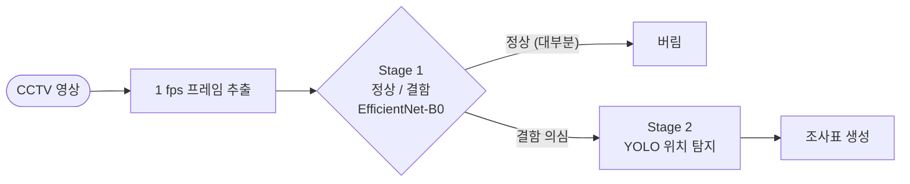

# Stage-1 정상/결함 분류 필터 구축

**작성일** 2026-08-11 · **대상** `scripts/classifier/` · **브랜치** `feat/stage1-classifier`

YOLO 탐지만으로 정확도가 안 나와서, 탐지 앞단에 **프레임 단위 정상/결함 분류기**를 두는
2단계 구조로 전환했다. 이 문서는 그 근거·데이터·학습·성능과, 검증 과정에서 확인한
한계를 정리한다.

---

## 1. 왜 분류기를 앞에 두는가

하수관로 CCTV는 대부분이 정상 구간이다. 그 프레임까지 전부 YOLO에 넣으면 오탐이
쌓이고, 그게 지금 정확도를 갉아먹는 주된 원인이다. 정상 프레임을 먼저 걷어내면
탐지기가 볼 대상 자체가 줄어든다.

`docs/인공지능 기반 하수관로 결함탐지 알고리즘 개발 연구.pdf`(서울디지털재단)가 같은
구조를 쓴다. 그 연구는 VGG-19로 10클래스(손상 8 + 비손상 IN·OUT 2)를 분류한 뒤,
**후처리로 비손상 2종을 버리는** 방식으로 결함 구간만 남긴다. 우리는 목적이 필터
하나뿐이므로 클래스를 정상/결함 2종으로 단순화했고, 백본만 EfficientNet-B0로 바꿨다.

**백본 선택 근거**: Stage 1은 모든 프레임이 통과하는 관문이라 처리량이 곧 제품 속도다.
EfficientNet-B0는 0.39 GFLOPs로 ConvNeXt-Tiny(4.5 GFLOPs)의 1/11이고, `serve_web_cpu.py`
같은 GPU 없는 환경도 감당할 수 있다.

---

## 2. 데이터 — `AI_CCTV_DATASET/clsdata_v1`

기존 데이터셋 두 곳을 합쳐 구성했다. **추가 라벨링은 하지 않았다.**

| 출처 | 역할 | 장수 |
|---|---|---|
| `original/aihub_data_bbox/image/` | 정상 5종 + 결함 9종 | 63,762 |
| `original/rename_data_s20_s22_bbox/` | 결함 24종 (AIHub에 없는 16종 보강) | 14,626 |

- **정상 5종**: IN(내부) · PJ(정상 이음부) · OUT_MH(맨홀) · OUT_INVERT(인버트) · OUT_CAR(자동차)
- **결함 25종**: BC BK CC CL CM CX DE DF DG DS ETC HL IF JD JF JS LD LP LS NS PO RT SD SG TO

S20/S22를 합치면서 결함 커버리지가 9종 → **25종**으로 늘었다. Stage-1 필터에서는
이게 결정적이다 — 학습에서 본 적 없는 결함 유형은 그냥 "정상"으로 흘려보내기 때문이다.

| 분할 | 정상 | 결함 | 합계 |
|---|---|---|---|
| train | 35,274 | 35,129 | 70,403 |
| val | 3,920 | 4,065 | 7,985 |
| | | | **78,388 / 1.17GB** |

정상:결함 1:1, 결함 코드당 상한 3,000장, 256px JPEG.

### 분할 시 누수 차단

S20 파일명에 소스 영상이 들어 있다(`JF_S20_01-00510.mp4_000213.734.jpg`, 고유 영상 2,532개).
같은 관로의 프레임이 train과 val에 나뉘면 검증 점수가 부풀려지므로 **영상 단위로** 나눴다.

초판은 (정상/결함, 코드)별로 따로 분할했는데, 영상 하나가 여러 결함 코드에 걸치는 경우가
많아(1,569개 중 685개가 2코드 이상) **162개 영상이 train·val 양쪽에 걸쳤다**(val의 5.6% 오염).
희소 코드부터 val 몫을 채우는 방식으로 고쳐 **겹침 0**을 만들었다. 이미지 재변환 없이
분할만 다시 계산하는 `resplit.py`로 적용했다.

---

## 3. 학습

EfficientNet-B0(ImageNet 사전학습), Colab T4, 24 epoch, batch 64, AdamW + 코사인 스케줄,
label smoothing 0.05. epoch당 489초, 총 약 3시간 20분.

- 결함 코드 내부 편차가 크므로(BK 3,000 vs NS 4) 가중 샘플링으로 희소 결함이 손실에
  묻히지 않게 했다.
- 수직 뒤집기는 쓰지 않았다. 토사퇴적(DS)처럼 중력 방향에 의미가 있는 결함이 있다.
- Colab 세션이 끊겨도 `last.pt`에서 이어받도록 매 epoch 체크포인트를 Drive에 저장한다.

결과물: `AI_CCTV_RESULTS/filter/best.pt` (epoch 23, val F1 0.9979)

---

## 4. 성능

### 4.1 기본 수치

| 조건 | 재현율 | 정상 오탐 | AUC |
|---|---|---|---|
| 전체 val | 99.66% (놓침 14/4,065) | 0.08% (3/3,920) | 0.99932 |
| **AIHub 결함 vs 관 안 정상** (가장 엄격) | **99.42%** | 0.03% (1/3,266) | 0.99884 |

놓친 14장: ETC 4 · LP 3 · DS 3 · CL 2 · BK 2 (전부 AIHub 출신)
오탐 3장: OUT_INVERT 1 · OUT_MH 1 · PJ 1 (IN 2,177장은 오탐 0)

### 4.2 중복 누수 검증 — 의심했고, 기각했다

AIHub는 소스 영상 정보가 없어 파일 단위로 무작위 분할할 수밖에 없었다. AIHub가 한
영상에서 여러 프레임을 뽑은 데이터라면 같은 장면이 train·val에 나뉘어 들어가고,
그러면 val 점수는 "외운 것을 맞힌" 결과가 된다.

지각 해시(dHash)로 확인한 결과 **중복은 실재했다**:

- AIHub val의 12.7%가 train과 해시 거리 0, 54.8%가 거리 ≤5
- 코드별로는 **IN 90%, PJ 85%** — 정상 클래스가 거의 통째로 겹침
- 픽셀 대조로 확인하니 거리 0 쌍의 **IN 60% / PJ 52%가 진짜 동일 장면**
  (나머지는 저대비 이미지의 해시 충돌)
- AIHub 원본 자체에 같은 이미지가 여러 클래스 폴더에 들어 있기도 하다
  (`aihub_CL_000744 ↔ aihub_SD_000799`, MAE 1.3)

**그런데 중복을 제외하고 다시 채점하니 성능이 떨어지지 않았다.**

| val 조건 | 남은 장수 | 재현율 | 정상 오탐 |
|---|---|---|---|
| 전체 | 7,985 (100%) | 99.66% | 0.08% |
| 거리 0 제외 | 7,021 (88%) | 99.64% | 0.10% |
| **거리 ≤5 제외** | 4,039 (51%) | **99.77%** | 0.10% |
| 거리 ≤10 제외 | 1,016 (13%) | 100% | 0.36% |

누수가 점수를 만들어냈다면 중복을 뺄 때 성능이 **떨어져야** 한다. 안 떨어졌다.
가장 엄격한 조건(AIHub 결함 vs 관 안 정상, 거리 ≤5 제외)에서도 재현율 99.62%,
정상 오탐 0/384다.

### 4.3 운용 임계값

| 목표 재현율 | 임계값 | 정상 통과율 |
|---|---|---|
| 95% | 0.973 | 0.00% |
| 98% | 0.969 | 0.00% |
| **99%** | **0.914** | **0.00%** |
| 99.5% | 0.356 | 0.12% |

**임계값 0.9 권장** — 결함 99% 이상을 잡으면서 정상 오탐 0.

---

## 5. 한계 (해결되지 않음)

### ① 결함 25종 중 9종만 정직하게 검증됐다

정상 이미지가 **전부 AIHub 출신**인데 결함 25종 중 16종은 **S20/S22에만** 있다. 두
데이터는 화질·압축 특성이 달라, 모델이 결함이 아니라 출처를 보고 갈랐을 수 있다.

실제로 S20/S22 결함 vs AIHub 정상의 **AUC가 정확히 1.00000**(완벽 분리)이다. 반면
출처가 같아 지름길이 차단된 AIHub 결함 vs AIHub 정상은 0.99885다. 놓친 14장이 전부
AIHub 출신인 것도 같은 얘기다.

- 검증됨(AIHub): BK CC CL DS ETC JD JF LP SD
- **측정 불가**(S20 전용): BC CM CX DE DF DG HL IF JS LD LS NS PO RT SG TO

현장 영상은 단일 출처라 이 지름길이 통하지 않는다. 이 16종의 실제 성능은 지금
데이터로는 **알 수 없다**. 해결하려면 S20과 같은 출처의 정상 이미지가 필요하다.

### ② 관 안 정상 표본이 작다

중복 제외 후 관 안 정상이 384장뿐이다. 오탐 0이지만 통계적으로는 "실제 오탐률
0.8% 이하" 정도까지만 말할 수 있다.

### ③ 실제 노후관로 영상 검증이 없다

전부 준비된 이미지 데이터셋이다. 참고 연구도 정제된 테스트셋에서 95.2%였지만,
실제 CCTV 영상 6개에서는 **결함 123개 중 62개(약 50%)만** 정확히 분류했다(§6.3).
같은 함정이 있을 수 있다.

`AI_CCTV_DATASET/video/`에 영상이 2개뿐이다. 노후관로 영상을 확보해 1 fps로 흘리고
실제 조사표와 대조하는 검증이 남았다.

---

## 6. 다음 단계

1. **노후관로 실제 영상 검증** — 위 ①②③을 한 번에 해소한다. 영상 확보가 선행 조건.
2. **Stage 1 → Stage 2 연결** — 임계값 0.9로 필터링 후 YOLO에 넘기는 파이프라인 구현.
3. **CPU 추론 연동** — `apps/AI_CCTV` 백엔드에 붙인다. B0는 CPU로 충분하다.
4. 신설관로용 별도 모델 — `fieldset_v1_label`을 파인튜닝 데이터로 사용(아래 참고).

---

## 부록 · fieldset 라벨 id 체계 정리 (같은 세션, 별도 작업)

`AI_CCTV_DATASET/fieldset_v1_label`은 **신설관로용** 데이터라 위 학습에 넣지 않았다.
다만 라벨 검수 과정에서 문제를 발견해 고쳤다.

**증상**: 정상 데이터를 클래스 30 하나로 합치려 했는데 번호가 제각각으로 들어가 있었다.

**원인**: 한 폴더에 **서로 다른 id 체계 두 개**가 섞여 있었다.

- 원본 이름 파일 307장 → 31클래스 글로벌 id
- Roboflow 내보내기 444장 → **9클래스 알파벳순 id**(`0=BK 1=DF 2=DS 3=ETC 4=JD 5=JF 6=JS 7=SG 8=TO`)

겉보기엔 CC·CL·CM·SD·BC·LD·CX 같은 라벨이 있는 것처럼 보였지만 실재하지 않는
착시였다. 같은 프레임의 원본/rf 쌍 **444건을 대조해 이 매핑이 100% 일치**함을 확인한 뒤
글로벌 id로 통일했다(박스 총계 702 보존, 유실 0).

부수적으로 확인·수정한 것:

- `data.yaml`이 `nc: 7`로 실제 라벨과 안 맞아 학습 시 범위 초과로 실패할 상태였다 → `nc: 31`
- 클래스 30(OUT_CAR)과 25/27/28/29(PJ/IN/OUT_MH/OUT_INVERT)는 **사용 횟수 0** —
  준비돼 있던 `remap_labels_to_30.py`는 실행해도 아무것도 바꾸지 않는다
- NORMAL 태그인데 결함 박스가 있는 36장, 결함 태그인데 박스가 0개인 34장(BC·LS는
  박스가 아예 없어 학습 데이터 0종)을 목록화해두었다

---

## 산출물

| 파일 | 역할 |
|---|---|
| `scripts/classifier/build_binary_dataset.py` | 두 출처를 합쳐 정상/결함 1:1 데이터셋 구성 |
| `scripts/classifier/resplit.py` | 이미지 재변환 없이 train/val 분할만 재계산 |
| `scripts/classifier/train_binary.py` | EfficientNet-B0 학습 (Colab 재개 지원) |
| `scripts/classifier/eval_binary.py` | 출처·코드별로 쪼갠 성능 평가 |
| `scripts/classifier/check_duplicates.py` | dHash로 train↔val 근접 중복 탐지 |
| `scripts/classifier/verify_duplicates.py` | 진짜 중복인지 해시 충돌인지 픽셀로 판별 |
| `scripts/classifier/clean_eval.py` | 중복 제외 val로 재채점 |

데이터·모델(저장소 밖): `AI_CCTV_DATASET/clsdata_v1` · `AI_CCTV_RESULTS/filter/best.pt`
