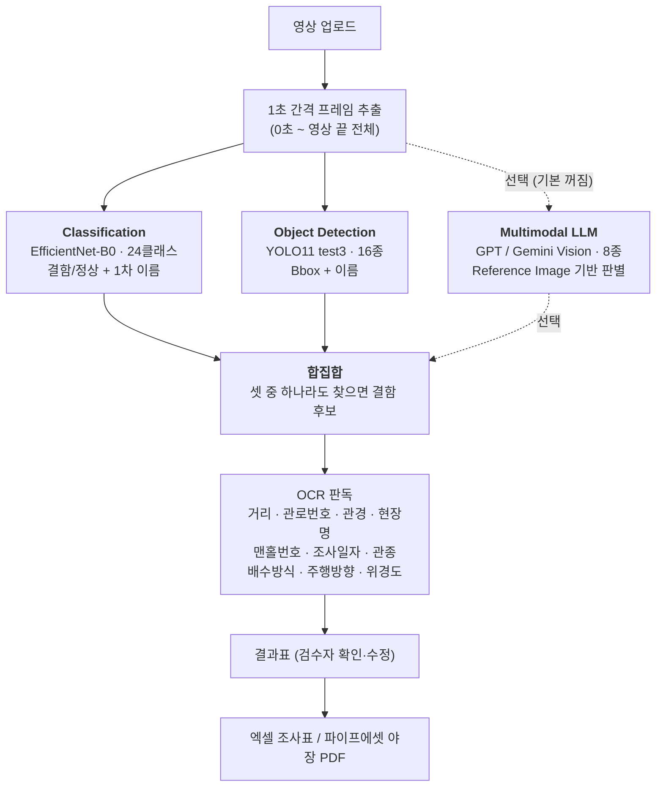
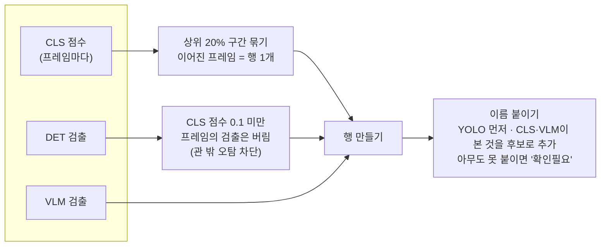
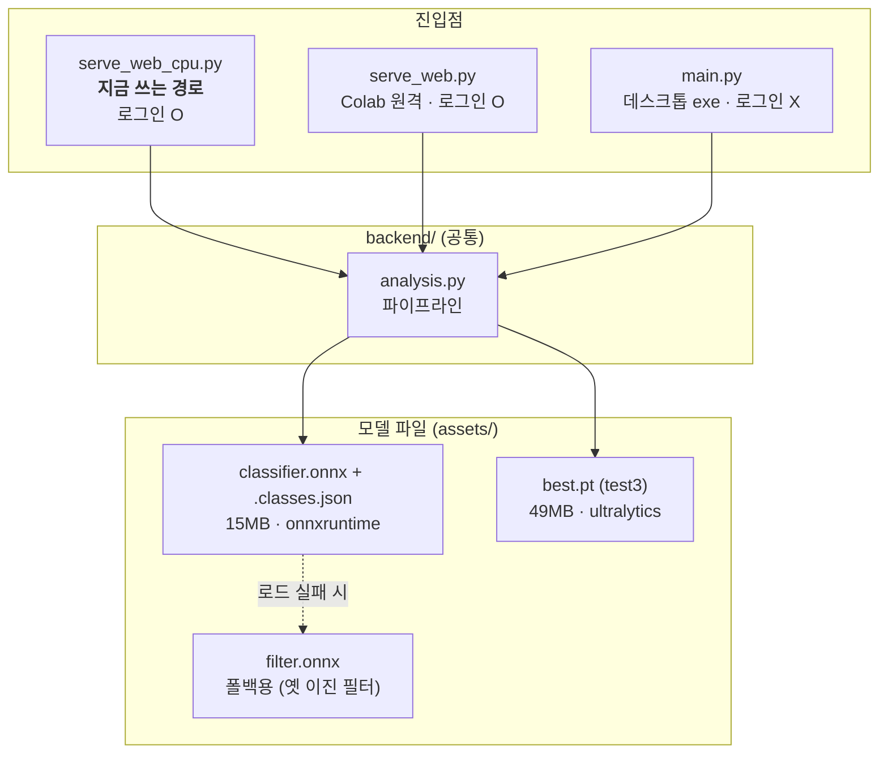

# 결함분석기 시스템 구조

**작성** 2026-08-16 · **대상** `apps/AI_CCTV` (배포 애플리케이션)

하수관로 CCTV 영상에서 결함을 찾아 조사표를 만드는 데스크톱/웹 앱의 구조 문서다.
학습 파이프라인은 별도다 —
[`2026-08-04-학습자동화-시스템구조.md`](2026-08-04-학습자동화-시스템구조.md) 참고.

실험 경과는 빼고 **확정된 구조와 결론만** 담는다. 모델 선정 과정은
[`2026-08-15-필터C-test3-병렬-확정.md`](2026-08-15-필터C-test3-병렬-확정.md)에 있다.

---

## 1. 무엇을 하는 시스템인가

조사원이 CCTV 영상을 처음부터 끝까지 눈으로 보며 결함을 찾고 수기로 조사표를
작성하던 일을, **AI가 후보를 뽑아주고 사람은 확인만 하는** 흐름으로 바꾼다.
현장 1개소(30km) 기준 약 40시간 걸리던 판독을 줄이는 것이 목표다.

핵심 설계는 **하나의 모델에 의존하지 않는 것**이다. 성격이 다른 판독기 셋이
같은 프레임을 각자 보고 결과를 합친다 — 어느 하나가 못 잡는 것을 다른 쪽이
메우게 하려는 구조이며, §3에서 그 효과를 실측으로 보인다.

---

## 2. 아키텍처

### 2.1 판독 3중 구조

세 판독기는 **서로 입력을 주고받지 않는다.** 같은 프레임을 독립적으로 보고,
결과는 뒤에서 합쳐진다. 코드가 순서대로 부를 뿐 종속 관계가 아니다.

**각 판독기가 내는 것이 다르다.**

| | 위치(박스) | 이름 | 학습 도메인 |
|---|---|---|---|
| CLS | ✗ | 24종 | 야장 중심(실제 조사영상) |
| DET | **○** | 16종 | S20/S22 + AIHub |
| VLM | ✗ | 8종 | (사전학습 + 예시 사진) |

박스는 YOLO만 만든다 — 나머지 둘은 위치를 모른다. 그래서 검수자가 화면에서
결함 위치를 눈으로 확인하려면 YOLO 검출이 있어야 한다.

### 2.2 결과를 합치는 규칙

**세 가지가 핵심이다.**

1. **합집합** — 셋 중 하나라도 찾으면 행이 생긴다. 예전에는 CLS가 고른 구간만
   행이 되고 YOLO 단독 발견은 로그 경고로만 남아 조사표에서 빠졌다. 같은 영상
   실측으로 14건 → 26건이 됐다.
2. **관 밖 차단** — YOLO는 맨홀·지상 전경을 결함이라 부른다(§3 오탐 표). CLS
   점수가 0.1 미만인 프레임의 YOLO 검출은 버린다. 결함 손해는 455장 중 1장.
3. **이름은 후보로 나열** — 판독기끼리 다르게 봤으면 둘 다 올리고 검수자가 고른다.
   박스가 있는 YOLO를 앞에 둔다(근거가 눈에 보이므로).

### 2.3 배포 구성

**분류기는 어느 진입점에서도 항상 로컬에서 돈다** — onnxruntime으로 직접 읽으므로
Colab 연결 여부와 무관하다. 원격으로 나가는 것은 YOLO뿐이다.

모델 파일은 `.gitignore`(`*.pt`, `*.onnx`)에 걸려 저장소에 없다. 클래스
이름표(`classifier.classes.json`)만 커밋돼 있고, **이름표가 없으면 분류기를 아예
열지 않는다** — 인덱스와 코드가 어긋나면 조용히 틀린 이름을 붙이기 때문이다.

### 주요 설정값

| 값 | 기본 | 의미 |
|---|---|---|
| `FRAME_INTERVAL` | 1초 | 2초는 프레임당 0.6m를 건너뛰어 결함이 사이로 빠졌다 |
| `FILTER_TOP_RATIO` | 0.20 | CLS 점수 상위 20%를 결함 후보로. **절대 임계값을 쓰지 않는다** — 야장은 결함 비율 45%인데 실영상은 1.5%라 같은 임계값이 전혀 다르게 동작한다 |
| `CLASSIFIER_MIN_CONF` | 0.90 | 이 확신 미만이면 CLS가 이름을 안 붙인다 |
| `YOLO_DROP_BELOW` | 0.10 | CLS 점수가 이보다 낮은 프레임의 YOLO 검출을 버린다 |
| `YOLO_CONF` / `YOLO_IMGSZ` | 0.10 / 960 | 학습 때와 같은 해상도 |

---

## 3. 성능 — 두 판독기는 서로를 메운다

### 3.1 측정 방법

**같은 사진으로 두 모델을 재는 것이 요점이다.** 지금까지는 판이 서로 달라
직접 비교가 성립하지 않았다(필터C는 야장 판, YOLO는 S20/AIHub 판).

`common_holdout`은 **두 모델의 학습분 186,014장을 모두 제외**하고 만들었다 —
어느 쪽도 본 적 없는 사진만 쓴다. 겹침 0장을 자동 검증한다
(`build_common_holdout.py`).

| | 구성 |
|---|---|
| 결함 | 12종 × 30장 = 360장 |
| 정상 | 200장 (PJ 60% · IN 20% · 관 밖 20%) |
| 기준 | CLS는 정상 오탐 5% 지점 · DET는 conf 0.10 |

**31종 중 12종만 잰 이유** — 나머지는 원본이 적어(JS 4,124장·LS 8,796장 등)
두 모델이 전량 학습에 써버려 검증할 사진이 남지 않았다. "성능 없음"이 아니라
"이 판으로 측정 불가"다. 그 19종은 각자의 기존 판 값을 엑셀에 참고치로 병기했다.

### 3.2 결과 — 합집합이 61.7% → 90.3%

12종 360장 기준:

| | 값 |
|---|---|
| DET(YOLO) 이름정확도 | 61.7% |
| CLS(필터) 이름정확도 | 40.8% |
| **합집합 (둘 중 하나라도 맞힘)** | **90.3%** |
| 겹침 (둘 다 맞힘) | 12.2% |
| **CLS만 맞힘** | **28.6%** |
| DET만 맞힘 | 49.4% |

**YOLO 단독 61.7%에서 합집합 90.3%로 28.6%p 오르고, 그 이득이 정확히 CLS 단독분과
같다.** 겹침이 12.2%뿐이라는 것은 두 모델이 거의 다른 사진을 맞힌다는 뜻이다.
이것이 판독기를 둘 이상 두는 근거다.

### 3.3 어디서 갈리는가 — 담당 범위가 다르다

상호보완의 실체는 "같은 문제를 다르게 푼다"가 아니라 **"아는 범위가 다르다"**이다.

| 구간 | 종류 | CLS 이름 | DET 이름 |
|---|---|---|---|
| **둘 다 아는 8종** | BK CC CL DS JD JF LP SD | 18.3% | **92.5%** |
| **CLS만 아는 4종** | BC DF DG LD | **85.8%** | 0% (클래스 없음) |

- **같은 종류를 두고 겨루면 YOLO가 앞선다** (92.5% vs 18.3%). 이 구간에서 CLS가
  단독으로 맞힌 것은 0장이다.
- **YOLO가 배우지 않은 종류는 CLS가 혼자 감당한다** (85.8%). test3의 16종에
  없는 결함이라 YOLO는 구조적으로 0%다.

### 3.4 도메인이 성능을 가른다

이번 판은 S20/AIHub(결함 도록) 도메인이다. **필터C는 야장(실제 조사영상) 중심으로
학습해 이 판에서 불리하다** — 야장 기반 판(`testset_bycode`)에서 69.7%였던 CLS
이름정확도가 여기서는 18.3%로 떨어졌다.

반대 방향도 확인됐다. YOLO(test5)를 S20/AIHub 판에서 재면 92.5%인데 야장으로
재면 33.3%로 무너진다.

**두 모델 모두 자기가 학습한 도메인에서만 제 성능을 낸다.** 실제 현장 영상은
야장 쪽에 가까우므로, 현장 성능은 이 표의 숫자보다 낮을 것으로 봐야 한다 —
실영상 연속 검증(베타테스트)이 다음 단계인 이유다.

### 3.5 정상 오탐 — 관 밖에서 갈린다

| 정상 종류 | 장수 | CLS 오탐 | DET 오탐 |
|---|---|---|---|
| IN (관 안) | 40 | 2% | 0% |
| PJ (이음부) | 120 | 7% | 1% |
| **OUT_CAR** | 11 | **0%** | **100%** |
| **OUT_MH (맨홀)** | 15 | **0%** | **87%** |
| **OUT_INVERT** | 14 | **7%** | **64%** |

**YOLO는 관 밖 장면을 결함이라 부르고, 필터C는 정확히 정상으로 본다.**
§2.2의 `YOLO_DROP_BELOW=0.10` 차단이 왜 필요한지를 이 표가 그대로 보여준다.
관 밖 걸러내기는 필터C의 또 다른 실질적 역할이다.

상세 표(31종 전체)는
[`2026-08-16-결함별-성능비교.xlsx`](2026-08-16-결함별-성능비교.xlsx) 참고.

---

## 4. 모듈 지도

| 파일 | 역할 |
|---|---|
| `backend/analysis.py` | 파이프라인 전체. 판독 호출 → 합집합 → 행 생성 |
| `backend/defect_classifier.py` | 분류기(CLS). 한 번 호출로 결함확률과 이름을 함께 반환 |
| `backend/yolo_infer.py` / `yolo_remote.py` | YOLO 로컬 / 원격(Colab) |
| `backend/llm_infer.py` | LLM 판독. **API 키는 메모리에만 두고 저장하지 않는다** |
| `backend/ocr.py` | 자막 판독 10종 (PaddleOCR) |
| `backend/annotate.py` | 보고서용 박스 그린 사진 + 화면 오버레이 좌표 |
| `backend/excel_export.py` / `pipeasset_pdf.py` | 조사표 / 야장 PDF |
| `backend/session_store.py` | 세션 자동 저장·복원 (영상마다·편집마다) |
| `backend/auth.py` | 로그인. 브라우저를 닫으면 세션이 풀린다 |

---

## 5. 운영 시 알아야 할 것

**폴백** — 분류기를 못 열면 옛 이진 필터(`filter.onnx`)로 자동으로 물러선다.
모델 파일을 아직 옮기지 않은 PC에서도 분석이 멈추지 않게 하기 위해서다. 다만
그 필터는 관 밖 오탐이 39%라 §2.2의 차단이 제 역할을 못 한다.

**아직 검증되지 않은 것** — 위 성능은 전부 잘라놓은 사진 판에서 잰 값이다.
연속 실영상(카메라 이동·조명 변화·대부분이 평범한 구간)에서의 검증은 하지 않았다.
§3.4의 도메인 문제 때문에 **현장 성능은 이보다 낮을 것으로 보는 것이 안전하다.**

**LLM은 기본 꺼짐** — 외부 API를 호출하므로 망분리 환경에서는 켜지지 않는다.
앱 화면에서 켜고 키를 그 자리에서 입력한다.

---

관련 문서 — [`2026-08-15-필터C-test3-병렬-확정.md`](2026-08-15-필터C-test3-병렬-확정.md)(모델 선정 근거) ·
[`2026-08-05-전체-유저플로우.md`](2026-08-05-전체-유저플로우.md)(사용자 관점 흐름) ·
[`2026-08-04-학습자동화-시스템구조.md`](2026-08-04-학습자동화-시스템구조.md)(학습 파이프라인) ·
[`../PRD.md`](../PRD.md)
